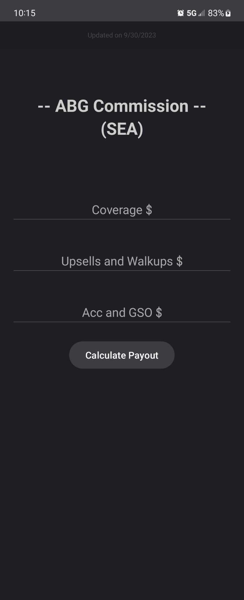
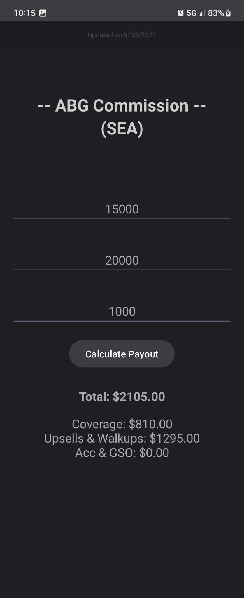
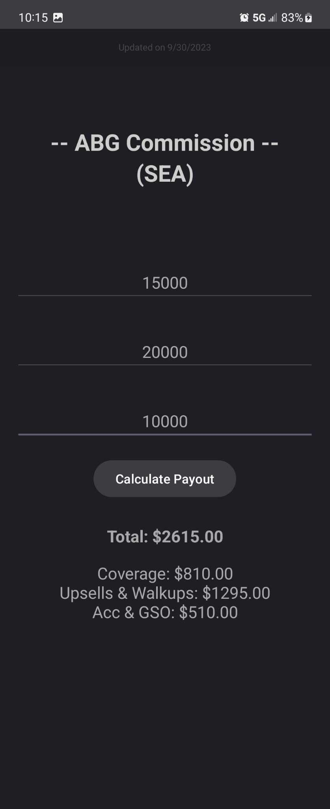
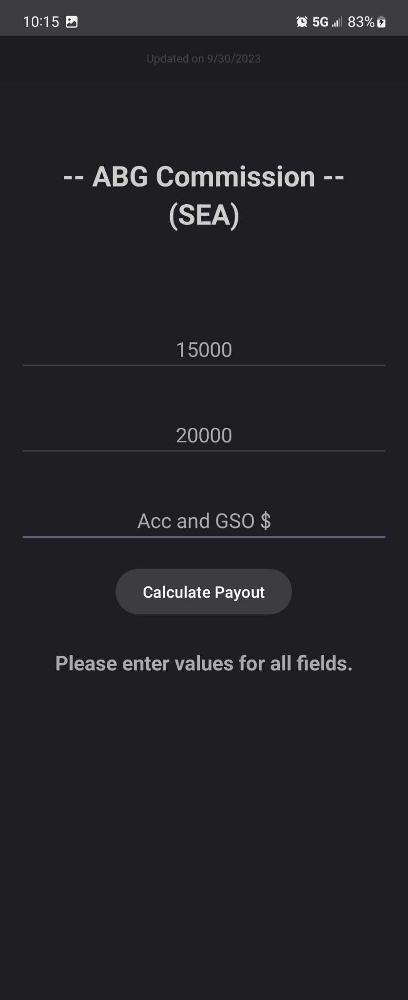

# AvisBudget - Commission Payout

Released/Download: [click here](https://github.com/akarhtutkaung/AvisBudget-Commission/releases/tag/v1.0.0)

## Overview

This application is a commission payout calculator designed for personal use and for coworkers working as RSA at the Seattle location. It simplifies the process of calculating commissions, making it easier and more efficient for employees to determine their earnings right away.

## Features

- Calculate commissions based on user-provided inputs.
- Input fields for relevant data, such as rentals, upgrades, insurance, and other sales.
- Instantly view commission payouts based on the provided data.
- User-friendly interface for easy navigation and data entry.

## Screenshots
   

## Getting Started

### Prerequisites

To use this application, you will need:

- An **Android** device running Android 5.0 (Lollipop) or higher.
- The APK file of the Commission Payout Calculator (Provide download link).

### Installation

1. Download the APK file of the [ABG_Commission.apk](ABG_Commission.apk)
2. Open the APK file on your Android device.
3. Follow the on-screen instructions to install the application.
 *Note: Since this app has not been released on play-store, the system will detect it as potential dangerous software. Thus, you would need to allow this warning from the system in order to install the software.*

## Usage

1. Open the ABG_Commission app on your Android device.
2. Enter the required data for rentals, upgrades, insurance, and other bonuses.
3. The app will automatically calculate the commission payout based on the provided data.
4. Review the calculated commission amount.

## Contributing

Contributions are welcome! If you would like to contribute to the development of this application or report issues, please follow these steps:

1. Fork the repository.
2. Create a new branch for your feature or bug fix.
3. Make your changes and commit them.
4. Push your changes to your fork.
5. Create a pull request to the main repository.

## License

This Commission Payout Calculator is available under the [MIT License](LICENSE).

## Contact

If you have any questions, suggestions, or need assistance, feel free to contact me at [akarthut99@gmail.com](mailto:akarthut99@gmail.com).

## Upcoming Features

- **Expanding Support**: I am actively working to expand support for different Avis Budget Group locations, making the calculator accessible to a wider audience.
